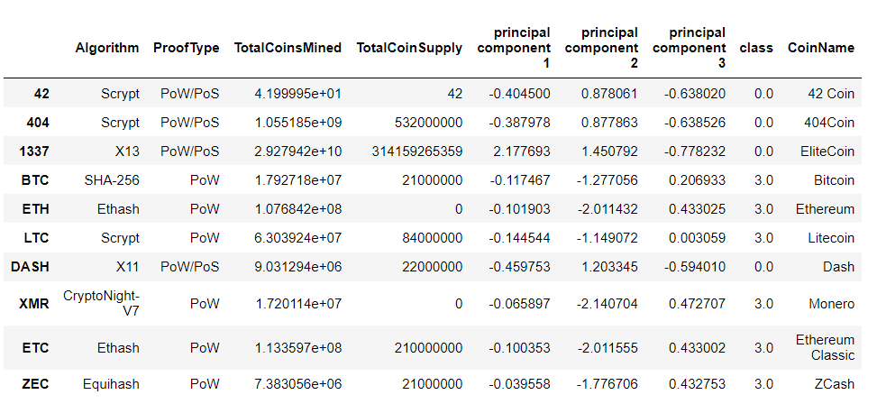
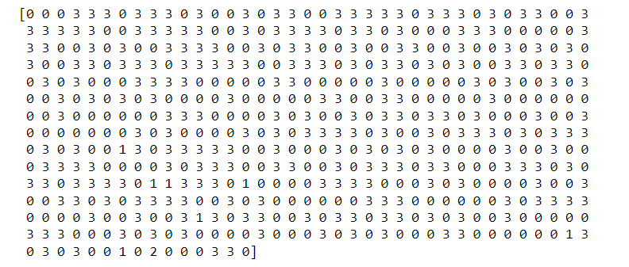
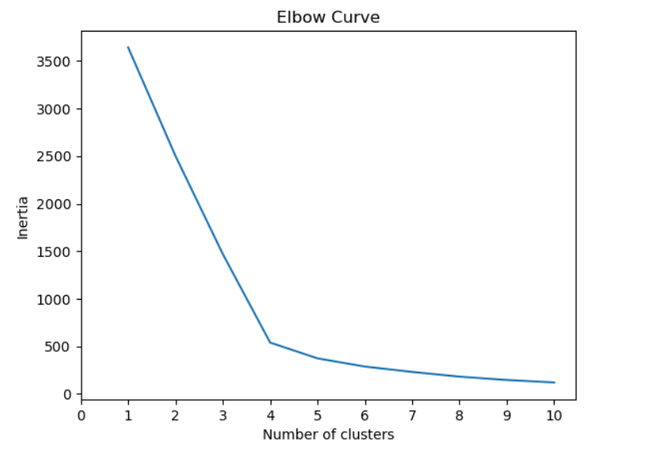
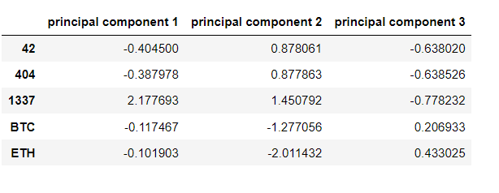
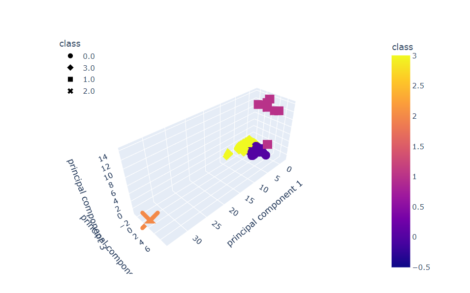

# Cryptocurrencies
# Cryptocurrencies
## Overview of Project
In Cryptocurrences analysis, Martha is a senior manager for the Advisory Services Team at Accountability Accounting, one of your most important clients. Accountability Accounting, a prominent investment bank, is interested in offering a new cryptocurrency investment portfolio for its customers. The company, however, is lost in the vast universe of cryptocurrencies. So, they’ve asked you to create a report that includes what cryptocurrencies are on the trading market and how they could be grouped to create a classification system for this new investment.
The data Martha will be working with is not ideal, so it will need to be processed to fit the machine learning models. Since there is no known output for what Martha is looking for, she has decided to use unsupervised learning. To group the cryptocurrencies, Martha decided on a clustering algorithm. She’ll use data visualizations to share her findings with the board.

## Analysis

Clustered df:

Clusters:

Elbow curve:

Principal components:

Scatter plot:

## Summary:

Unsupervised machine learning is great tool to Transform the data to create an intuitive representation for analysis or to use in another machine learning model; or Cluster or determine patterns in a grouping of data, rather than to predict a classification.

